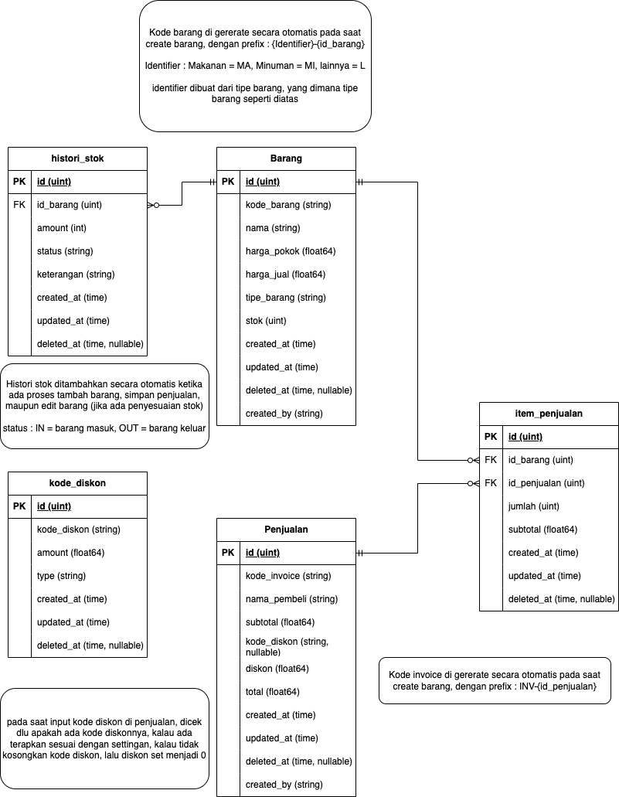

## Topik #1 : _Web Service : Toko Retail_

### Deskripsi Project

Anda merupakan seorang programmer yang diminta untuk mengembangkan sebuah web service yang bertugas untuk mengelola data pada sebuah toko retail. yang dimana memiliki banyak barang dalam jumlah stok yang banyak, serta melakukan penjualan. Untuk desain database sudah disediakan oleh client.

DB Design:



Kebutuhan dari client adalah :

1. Sistem mampu untuk melakukan manajemen barang beserta stoknya, jadi jika ada penambahan atau pengurangan dapat dilakukan, dan juga histori penambahan dan pengurangan stok harus tercatat.
2. Sistem mampu untuk melakukan penjualan barang dalam jumlah banyak, dengan dapat memberikan diskon dengan kode, dan jika ada penjualan, stok otomatis langsung disesuaikan.
3. Sistem mampu untuk menampilkan penjualan secara bulanan.

### Project Specification

Sesuai dengan kebutuhan dari client, ada beberapa proses bisnis yang difokuskan, berikut adalah api spec yang sudah disepakati:

1. Barang

   | Path              | Method | Req Param | Body                                          | Response                                                  | Deskripsi                                                            |
   | :---------------- | :----- | :-------- | :-------------------------------------------- | :-------------------------------------------------------- | :------------------------------------------------------------------- |
   | /barang           | GET    | -         | -                                             | [Response get all barang](#response-get-all-barang)       | Menampilkan data barang dengan limit 50 data terakhir                |
   | /barang/{id}      | GET    | -         | -                                             | [Response get barang per id](#response-get-detail-barang) | Menampilkan data barang per barang secara detail dengan histori stok |
   | /barang           | POST   | -         | [Body Create](#body-create-barang)            | -                                                         | Input data barang, beserta keterangan stok                           |
   | /barang/{id}      | PUT    | -         | [Body Update](#body-update-barang)            | -                                                         | Update data barang                                                   |
   | /barang/stok/{id} | PUT    | -         | [Bopdy Update Stok](#body-update-stok-barang) | -                                                         | Update data stok barang saja                                         |
   | /barang/{id}      | DELETE | -         | -                                             | -                                                         | Hapus barang, beserta histori stok                                   |

   ###### Response get all barang

   ```json
   {
     "data": [
       {
         "id": 1,
         "kode_barang": "M-001",
         "nama_barang": "air mineral",
         "harga_pokok": 3500,
         "harga_jual": 4000,
         "tipe_barang": "MINUMAN",
         "stok": 20,
         "created_at": "2023-10-31 00:00:00",
         "updated_at": "2023-10-31 00:00:00",
         "deleted_at": null,
         "created_by": "SYSTEM"
       },
       {
         "id": 2,
         "kode_barang": "M-002",
         "nama_barang": "air mineral 1",
         "harga_pokok": 3500,
         "harga_jual": 4000,
         "tipe_barang": "MINUMAN",
         "stok": 20,
         "created_at": "2023-10-31 00:00:00",
         "updated_at": "2023-10-31 00:00:00",
         "deleted_at": null,
         "created_by": "SYSTEM"
       }
     ]
   }
   ```

   ###### Response get detail barang

   ```json
   {
     "data": {
       "id": 1,
       "kode_barang": "M-001",
       "nama_barang": "air mineral",
       "harga_pokok": 3500,
       "harga_jual": 4000,
       "tipe_barang": "MINUMAN",
       "stok": 20,
       "created_at": "2023-10-31 00:00:00",
       "updated_at": "2023-10-31 00:00:00",
       "deleted_at": null,
       "created_by": "SYSTEM",
       "histori_stok": [
         {
           "amount": 50,
           "status": "IN",
           "keterangan": "initial stok",
           "created_at": "2023-10-31 00:00:00",
           "updated_at": "2023-10-31 00:00:00",
           "deleted_at": null
         },
         {
           "amount": 30,
           "status": "OUT",
           "keterangan": "terjual",
           "created_at": "2023-10-31 00:00:00",
           "updated_at": "2023-10-31 00:00:00",
           "deleted_at": null
         }
       ]
     }
   }
   ```

   ###### Body create barang

   ```json
   {
     "nama_barang": "air mineral",
     "harga_pokok": 3500,
     "harga_jual": 4000,
     "tipe_barang": "MINUMAN",
     "stok": 50,
     "created_by": "SYSTEM",
     "histori_stok": {
       "amount": 50,
       "status": "IN",
       "keterangan": "initial stok"
     }
   }
   ```

   ###### Body update barang

   ```json
   {
     "nama_barang": "air mineral",
     "harga_pokok": 3500,
     "harga_jual": 4000,
     "created_by": "SYSTEM"
   }
   ```

   ###### Body update stok barang

   ```json
   {
     "stok": 50,
     "histori_stok": {
       "amount": 50,
       "status": "IN",
       "keterangan": "initial stok"
     }
   }
   ```

2. Penjualan

   | Path            | Method | Req Param | Body                                  | Response                                                        | Deskripsi                                                                 |
   | :-------------- | :----- | :-------- | :------------------------------------ | :-------------------------------------------------------------- | :------------------------------------------------------------------------ |
   | /penjualan      | GET    | -         | -                                     | [Response Get all penjualan](#response-get-all-penjualan)       | Menampilkan data penjualan dengan limit 50 data terakhir                  |
   | /penjualan/{id} | GET    | -         | -                                     | [Response Get Detail Penjualan](#response-get-detail-penjualan) | Menampilkan data penjualan per id secara detail dengan barang yang dibeli |
   | /penjualan      | POST   | -         | [Body Create](#body-create-penjualan) | -                                                               | Input data penjualan, beserta barang yang dibeli                          |

   ###### Response get all penjualan

   ```json
   {
     "data": [
       {
         "id": 1,
         "kode_invoice": "INV/1",
         "nama pembeli": "asep",
         "subtotal": 10000,
         "kode_diskon": null,
         "diskon": 0,
         "total": 10000,
         "created_at": "2023-10-31 00:00:00",
         "updated_at": "2023-10-31 00:00:00",
         "deleted_at": null,
         "created_by": "SYSTEM"
       },
       {
         "id": 2,
         "kode_invoice": "INV/2",
         "nama pembeli": "asep",
         "subtotal": 10000,
         "kode_diskon": null,
         "diskon": 0,
         "total": 10000,
         "created_at": "2023-10-31 00:00:00",
         "updated_at": "2023-10-31 00:00:00",
         "deleted_at": null,
         "created_by": "SYSTEM"
       }
     ]
   }
   ```

   ###### Response get detail penjualan

   ```json
   {
     "data": {
       "id": 1,
       "kode_invoice": "INV/1",
       "nama pembeli": "asep",
       "subtotal": 20000,
       "kode_diskon": null,
       "diskon": 0,
       "total": 20000,
       "created_at": "2023-10-31 00:00:00",
       "updated_at": "2023-10-31 00:00:00",
       "deleted_at": null,
       "created_by": "SYSTEM",
       "item_penjualan": [
         {
           "kode_barang": "MI-1",
           "jumlah": 1,
           "subtotal": 10000,
           "created_at": "2023-10-31 00:00:00",
           "updated_at": "2023-10-31 00:00:00",
           "deleted_at": null
         },
         {
           "kode_barang": "MI-2",
           "jumlah": 1,
           "subtotal": 10000,
           "created_at": "2023-10-31 00:00:00",
           "updated_at": "2023-10-31 00:00:00",
           "deleted_at": null
         }
       ]
     }
   }
   ```

   ###### Body create penjualan

   ```json
   {
     "nama pembeli": "asep",
     "subtotal": 20000,
     "kode_diskon": "TEST123",
     "total": 20000,
     "created_by": "SYSTEM",
     "item_penjualan": [
       {
         "kode_barang": "MI-1",
         "jumlah": 1,
         "subtotal": 10000
       },
       {
         "kode_barang": "MI-2",
         "jumlah": 1,
         "subtotal": 10000
       }
     ]
   }
   ```

3. Kode Diskon

   | Path                     | Method | Req Param   | Body                                    | Response                                                            | Deskripsi                                                  |
   | :----------------------- | :----- | :---------- | :-------------------------------------- | :------------------------------------------------------------------ | :--------------------------------------------------------- |
   | /kode-diskon             | GET    | -           | -                                       | [Response get all kode diskon](#response-get-all-kode-diskon)       | Menampilkan data kode diskon dengan limit 50 data terakhir |
   | /kode-diskon/{id}        | GET    | -           | -                                       | [Response get kode diskon per id](#response-get-single-kode-diskon) | Menampilkan data kode diskon per id                        |
   | /kode-diskon/get-by-code | GET    | kode-diskon | -                                       | [Response get kode diskon per id](#response-get-single-kode-diskon) | Menampilkan data kode diskon berdasarkan kode diskon       |
   | /kode-diskon             | POST   | -           | [Body Create](#body-create-kode-diskon) | -                                                                   | Input data kode diskon, tidak boleh ada kode yang sama     |
   | /kode-diskon/{id}        | PUT    | -           | [Body Update](#body-update-kode-diskon) | -                                                                   | Update data kode diskon by id                              |
   | /kode-diskon/{id}        | DELETE | -           | -                                       | -                                                                   | Hapus kode diskon                                          |

   ###### Response get all kode diskon

   ```json
   {
     "data": [
       {
         "id": 1,
         "kode_diskon": "eganjfa",
         "amount": 10,
         "type": "PERCENT",
         "created_at": "2023-10-31 00:00:00",
         "updated_at": "2023-10-31 00:00:00",
         "deleted_at": null
       },
       {
         "id": 2,
         "kode_diskon": "eganjfa",
         "amount": 10000,
         "type": "FIXED",
         "created_at": "2023-10-31 00:00:00",
         "updated_at": "2023-10-31 00:00:00",
         "deleted_at": null
       }
     ]
   }
   ```

   ###### Response get single kode diskon

   ```json
   {
     "data": {
       "id": 1,
       "kode_diskon": "eganjfa",
       "amount": 10,
       "type": "PERCENT",
       "created_at": "2023-10-31 00:00:00",
       "updated_at": "2023-10-31 00:00:00",
       "deleted_at": null
     }
   }
   ```

   ###### Body create kode diskon

   ```json
   {
     "kode_diskon": "eganjfa",
     "amount": 10,
     "type": "PERCENT"
   }
   ```

   ###### Body update kode diskon

   ```json
   {
     "amount": 10,
     "type": "PERCENT"
   }
   ```
