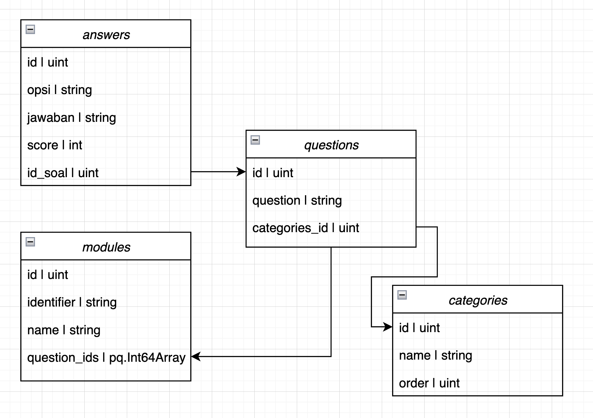

## Topik #3 : _Web Service : Question Random Generator_

### Deskripsi Project

Anda merupakan seorang engineer yang diminta untuk mengembangkan sebuah web service pada suatu startup edutech, dimana terdapat sebuah permintaan fitur agar soal yang ditampilkan pada sisi client merupakan soal acak tetapi sesuai kategori yang terurut.

DB Design:



Kebutuhan dari client adalah :

1. Sistem mampu melakukan manajemen modul, beserta soal, jawaban, dan kategorinya
2. API Manajemen diatas harus disertai middleware, dimana hanya akses dengan role "admin" yang dapat mengakses API manajemen tersebut
3. Sistem mampu untuk menampilkan soal berdasarkan modul identifier yang dikirimkan
4. Soal yang ditampilkan telah diacak urutannya beserta dengan jawabannya juga diacak, tetapi untuk urutan soal nya dimulai dari 1 dan opsi jawabannya dimulai dari A
5. Soal yang diacak, kategorinya harus berurutan, misalnya kategori A berisi 3 soal, X Y Z, lalu kategori B berisi 2 soal G H, urutan soal tidak boleh G Y X H Z, tetapi harus Z X Y H G


### Project Specification

Sesuai dengan kebutuhan dari client, ada beberapa proses bisnis yang difokuskan, berikut adalah api spec yang sudah disepakati beserta dengan responsenya:

1. Category

   | Path              | Method | Req Param | Body                                          | Response                                                  | Deskripsi                                                            |
   | :---------------- | :----- | :-------- | :-------------------------------------------- | :-------------------------------------------------------- | :------------------------------------------------------------------- |
   | /categories           | GET    | -         | -                                             | [Response get all kategori](#response-get-all-kategori)       | Menampilkan data kategori dengan limit 50 data terakhir                |
   | /categories/{id}      | GET    | -         | -                                             | [Response get kategori per id](#response-get-detail-kategori) | Menampilkan data kategori berdasarkan id  |
   | /categories           | POST   | -         | [Body Create](#body-create-dan-update-kategori)            | -                                                         | Input data kategori baru                       |
   | /categories/{id}      | PUT    | -         | [Body Update](#body-create-dan-update-kategori)            | -                                                         | Update data kategori                                               |
   | /categories/{id}      | DELETE | -         | -                                             | -                                                         | Hapus kategori                                   |


   ###### Response get all kategori

   ```json
    Response 200 OK
    
    {
        "data": [
            {
                "id": 1,
                "created_at": "2024-04-02T11:09:10.144Z",
                "updated_at": "2024-04-02T11:09:10.144Z",
                "deleted_at": null,
                "name": "Kategori A",
                "order": 1
            },
            ...
        ],
        "message": "Success"
    }
   ```

   ###### Response get detail kategori

   ```json
    Response 200 OK
    
    {
        "data":{
            "id": 1,
            "created_at": "2024-04-02T11:09:10.144Z",
            "updated_at": "2024-04-02T11:09:10.144Z",
            "deleted_at": null,
            "name": "Kategori A",
            "order": 1
        },
        "message": "Success"
    }
   ```

   ###### Body create dan update kategori

   ```json
    Response 201 Created untuk Create
    Response 200 OK untuk Update

    {
        "name": "Kategori C",
        "order": 3
    }
   ```

2. Answer (Jawaban/Opsi Soal)

   | Path              | Method | Req Param | Body                                          | Response                                                  | Deskripsi                                                            |
   | :---------------- | :----- | :-------- | :-------------------------------------------- | :-------------------------------------------------------- | :------------------------------------------------------------------- |
   | /answers           | GET    | -         | -                                             | [Response get all answer](#response-get-all-answer)       | Menampilkan data answer dengan limit 50 data terakhir                |
   | /answers/{id}      | GET    | -         | -                                             | [Response get answer per id](#response-get-detail-answer) | Menampilkan data answer berdasarkan id  |
   | /answers           | POST   | -         | [Body Create](#body-create-dan-update-answer)            | -                                                         | Input data answer baru                       |
   | /answers/{id}      | PUT    | -         | [Body Update](#body-create-dan-update-answer)            | -                                                         | Update data answer                                               |
   | /answers/{id}      | DELETE | -         | -                                             | -                                                         | Hapus answer                                   |


   ###### Response get all answer

   ```json
    Response 200 OK
    
    {
        "data": [
            {
                "id": 33,
                "created_at": "2024-04-02T11:17:37.265Z",
                "updated_at": "2024-04-02T11:17:37.265Z",
                "deleted_at": null,
                "opsi": "C",
                "jawaban": "Benar",
                "score": 5,
                "question_id": 11
            }
        ],
        "message": "Success"
    }
   ```

   ###### Response get detail answer

   ```json
    Response 200 OK
    
    {
        "data":{
            "id": 33,
            "created_at": "2024-04-02T11:17:37.265Z",
            "updated_at": "2024-04-02T11:17:37.265Z",
            "deleted_at": null,
            "opsi": "C",
            "jawaban": "Benar",
            "score": 5,
            "question_id": 11
        },
        "message": "Success"
    }
   ```

   ###### Body create dan update answer

   ```json
    Response 201 Created untuk Create
    Response 200 OK untuk Update

    {
        "opsi": "A",
        "jawaban": "Benar",
        "score": 5,
        "question_id": 1
    }
   ```

3. Question (Soal)

   | Path              | Method | Req Param | Body                                          | Response                                                  | Deskripsi                                                            |
   | :---------------- | :----- | :-------- | :-------------------------------------------- | :-------------------------------------------------------- | :------------------------------------------------------------------- |
   | /questions           | GET    | -         | -                                             | [Response get all question](#response-get-all-question)       | Menampilkan data question dengan limit 50 data terakhir                |
   | /questions/{id}      | GET    | -         | -                                             | [Response get question per id](#response-get-detail-question) | Menampilkan data question berdasarkan id disertai data answer nya   |
   | /questions           | POST   | -         | [Body Create](#body-create-dan-update-question)            | -                                                         | Input data question baru                       |
   | /questions/{id}      | PUT    | -         | [Body Update](#body-create-dan-update-question)            | -                                                         | Update data question                                               |
   | /questions/{id}      | DELETE | -         | -                                             | -                                                         | Hapus question                                   |


   ###### Response get all question

   ```json
    Response 200 OK
    
    {
        "data": [
        {
            "id": 11,
            "created_at": "2024-04-02T11:17:37.248Z",
            "updated_at": "2024-04-02T11:17:37.248Z",
            "deleted_at": null,
            "question": "Saya adaalah Soal C2",
            "category_id": 3,
            "category": {
                "id": 3,
                "created_at": "2024-04-02T11:11:13.13Z",
                "updated_at": "2024-04-02T11:11:13.13Z",
                "deleted_at": null,
                "name": "Kategori C",
                "order": 3
            }
        }
        ],
        "message": "Success"
    }
   ```

   ###### Response get detail question

   ```json
    Response 200 OK
    
    {
        "data": {
            "id": 11,
            "created_at": "2024-04-02T11:17:37.248Z",
            "updated_at": "2024-04-02T11:17:37.248Z",
            "deleted_at": null,
            "question": "Saya adaalah Soal C2",
            "category_id": 3,
            "category": {
                "id": 3,
                "created_at": "2024-04-02T11:11:13.13Z",
                "updated_at": "2024-04-02T11:11:13.13Z",
                "deleted_at": null,
                "name": "Kategori C",
                "order": 3
            },
            "answers": [
            {
                "id": 31,
                "created_at": "2024-04-02T11:17:37.258Z",
                "updated_at": "2024-04-02T11:17:37.258Z",
                "deleted_at": null,
                "opsi": "A",
                "jawaban": "Benar",
                "score": 5,
                "question_id": 11
            },
            ...
            ]
        },
        "message": "Success"
    }
   ```

   ###### Body create dan update question

   ```json
    Response 201 Created untuk Create
    Response 200 OK untuk Update

    {
        "opsi": "A",
        "jawaban": "Benar",
        "score": 5,
        "question_id": 1
    }
   ```

4. Modul

   | Path              | Method | Req Param | Body                                          | Response                                                  | Deskripsi                                                            |
   | :---------------- | :----- | :-------- | :-------------------------------------------- | :-------------------------------------------------------- | :------------------------------------------------------------------- |
   | /modules           | GET    | -         | -                                             | [Response get all modules](#response-get-all-module)       | Menampilkan data modul dengan limit 50 data terakhir                |
   | /modules/{id}      | GET    | -         | -                                             | [Response get module per id](#response-get-detail-module) | Menampilkan data modul berdasarkan id dilengkapi data soal |
   | /modules           | POST   | -         | [Body Create](#body-create-dan-update-modul)            | -                                                         | Input data modul baru                       |
   | /modules/{id}      | PUT    | -         | [Body Update](#body-create-dan-update-modul)            | -                                                         | Update data modul                                               |
   | /modules/{id}      | DELETE | -         | -                                             | -                                                         | Hapus modul                                   |


   ###### Response get all module

   ```json
    Response 200 OK
    
    {
        "data": [
            {
                "id": 2,
                "created_at": "2024-04-02T11:28:51.499Z",
                "updated_at": "2024-04-02T11:28:51.499Z",
                "deleted_at": null,
                "identifier": "MDL-1712057331",
                "name": "Module A",
                "question_ids": [
                    1, 2
                ]
            }
        ],
        "message": "Success"
    }
   ```

   ###### Response get detail module

   ```json
    Response 200 OK
    
    {
    "data": {
        "id": 3,
        "created_at": "2024-04-02T11:29:03.306Z",
        "updated_at": "2024-04-02T11:29:03.306Z",
        "deleted_at": null,
        "identifier": "MDL-1712057343",
        "name": "Module A",
        "questions": [
        {
            "id": 1,
            "created_at": "2024-04-02T11:16:32.163Z",
            "updated_at": "2024-04-02T11:16:32.163Z",
            "deleted_at": null,
            "question": "Saya adaalah Soal A",
            "category_id": 1,
            "category": {
                "id": 1,
                "created_at": "2024-04-02T11:09:10.144Z",
                "updated_at": "2024-04-02T11:09:10.144Z",
                "deleted_at": null,
                "name": "Kategori A",
                "order": 1
            },
            "answers": [
            {
                "id": 1,
                "created_at": "2024-04-02T11:16:32.181Z",
                "updated_at": "2024-04-02T11:16:32.181Z",
                "deleted_at": null,
                "opsi": "A",
                "jawaban": "Benar",
                "score": 5,
                "question_id": 1
            },
            ...
            ]
        },
        ...
        ]
    },
    "message": "Success"
    }
   ```

   ###### Body create dan update modul

   ```json
    Response 201 Created untuk Create
    Response 200 OK untuk Update

    {
        "name": "Module A",
        "question_ids":[
            1,2,3,4,5,6,7,8,9
        ]
    }
   ```

5. Get Soal

   | Path              | Method | Req Param | Body                                          | Response                                                  | Deskripsi                                                            |
   | :---------------- | :----- | :-------- | :-------------------------------------------- | :-------------------------------------------------------- | :------------------------------------------------------------------- |
   | /exam/questions/{module_identifier}       | GET    | -         | -                                             | [Response get soal client](#response-get-soal-client)       | Menampilkan data soal yang telah diacak dari suatu modul berdasarkan identifiernya             |


   ###### Response get soal client

   ```json
    Response 200 OK

    {
        "data": {
            "identifier": "MDL-1712057343",
            "name": "Module A",
            "exam_questions": [
            {
                "id": 3,
                "question": "Saya adalah Soal A2",
                "order": 1,
                "category_name": "Kategori A",
                "category_order": 1,
                "answers": [
                {
                    "id": 7,
                    "opsi": "A",
                    "jawaban": "Misal nya Kamu"
                },
                {
                    "id": 9,
                    "opsi": "B",
                    "jawaban": "Misalnya Dia"
                },
                {
                    "id": 8,
                    "opsi": "C",
                    "jawaban": "Misalnya Aku"
                }
                ]
            },
            ...
            ]
        },
        "message": "Success"
        }
   ```
