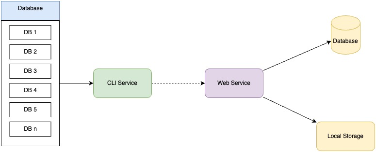

## Topik #4 : *CLI App & Web Service : Database Auto Backup*

### Deskripsi Project 

Anda adalah seorang system engineer yang bekerja pada sebuah perusahaan multinasional yang bergerak dalam pengembangan sistem enterprise. Saat ini perushaan anda telah meng-handle lebih dari 100 client mulai dari sistem hingga infrastruktur yang mereka gunakan. 

Suatu hari technical lead di perusahaan anda, meminta anda untuk membuat service app untuk melakukan automation backup database pada setiap project client setiap harinya. Yang dimana setiap database yang telah di *dump* lalu di compress dengan ZIP lalu di upload ke sebuah web service yang fungsi utamanya untuk menerima backup database yang sudah di zip/compress.

### Project Specification



Pada project ini akan ada 2 aplikasi/service yang ada harus buat

#### 1. Web Service

Sesuai dengan informasi yang diberikan oleh tech lead anda, bahwa akan ada web service yang tugas nya untuk menerima data upload file zip, yang dimana spesifikasi lengkap sebagai berikut.

1. Web Service memiliki beberapa route seperti tabel dibawah
    
   | Path | Method | Req Param | Body | Response | Deskripsi |
   |:-----|:-------|:----------|:-----|:---|:---|
   | /| GET |-|-| [Response 1](#response-1)|Memberikan list database yang dibackup terakhir| 
   | /{db_name}|GET | `db_name` : adalah nama database yang pernah di backup |-|[Response 2](#response-2)| Memberikan list history sebuah database file zip yang pernah di upload |
   | /{db_name}|POST |`db_name` : adalah nama database yang pernah di backup |`multipart/form-data` body dari file zip dan `db_name` sebagai parameter |[Response 3](#response-3)| Melakukan upload file zip ke web service|
   |/{id_file}/download| GET |`id_file`: merupakan id file yang ingin di download|file zip dari storage|stream data |Melakukan download file|
   ###### Response 1
   ```json
   {
    "data": [
            {
                "database_name": "pt_xyz",
                "latest_backup": {
                    "id": 34,
                    "file_name": "mysql-2023-10-31-00-00-00-pt_xyz-0f69a75b-9fdf-48c6-8ec9-2277934b7bb8.sql.zip",
                    "timestamp": "2023-10-31 00:00:00"
                }
            },
            {
                "database_name": "pt_abc",
                "latest_backup": {
                    "id": 100,
                    "file_name": "mysql-2023-10-31-00-00-00-pt_abc-c584d377-0082-4473-a32b-29510d922fde.zip",
                    "timestamp": "2023-10-31 00:00:00"
                }
            },
            {
                "database_name": "pt_limajari",
                "latest_backup": {
                    "id": 201,
                    "file_name": "mysql-2023-10-31-00-00-00-pt_limajari-6077b272-9f9f-4fe2-9924-b92b2cbbc2d5.sql.zip",
                    "timestamp": "2023-10-31 00:00:00"
                }
            },
            {
                "database_name": "cv_kucing_oren",
                "latest_backup": {
                    "id": 303,
                    "file_name": "mysql-2023-10-31-00-00-00-cv_kucing_oren-0f69a75b-9fdf-48c6-8ec9-2277934b7bb8.sql.zip",
                    "timestamp": "2023-10-31 00:00:00"
                }
            },
    ],
    "message": "Success"
   }
   ```

   ###### Response 2
   ```json
    {
        "data": {
            "database_name": "cv_kucing_oren",
            "histories": [
                {
                    "id" : 303,
                    "file_name": "mysql-2023-10-31-00-00-00-cv_kucing_oren-0f69a75b-9fdf-48c6-8ec9-2277934b7bb8.sql.zip",
                    "timestamp": "2023-10-31 00:00:00"
                },
                {
                    "id": 299,
                    "file_name": "mysql-2023-10-30-00-00-00-cv_kucing_oren-7634bf3f-23b5-45a7-8b78-fe9b1a3bcf66.sql.zip",
                    "timestamp": "2023-10-30 00:00:00"
                },
                {
                    "id": 295,
                    "file_name": "mysql-2023-10-29-00-00-00-cv_kucing_oren-8634bf3f-23b5-45a7-8b78-fe9b1a3bcf66.sql.zip",
                    "timestamp": "2023-10-29 00:00:00"
                }
            ]
        },
        "message": "success"
    }
   ```

   ##### Response 3
   ```json
    {
        "data": {
            "id": 295,
            "database_name": "cv_kucing_oren",
            "file_name": "mysql-2023-10-29-00-00-00-cv_kucing_oren-8634bf3f-23b5-45a7-8b78-fe9b1a3bcf66.sql.zip",
            "timestamp": "2023-10-29 00:00:00"
        },
        "message": "success"
    }
   ```
2. Web Service menggunakan database MySQL yang digunakan untuk menyimpan history file yang pernah disimpan, struktur database dapat disesuikan seperti response data diatas.
3. Web Service juga akan menyimpan file yang di upload nantinya kedalam sebuah folder, yang dimana ketika file ingin didownload, web service dapat penyediakan fungsi untuk mendownload tersebut.
4. Penamaan file yang disimpan adalah file dari client, web service tidak melakukan renaming.
5. Web Service memastikan data yang dikirim sesuai dengan valiadtio.
6. Setiap case error harus di handle oleh Web Service
7. Dilengkapi dengan unit testing

#### 2. CLI App
1. CLI App setiap dijalankan akan otomatis melakukan proses `dump`, `zip`, `upload`
2. Pertama kali aplikasi CLI akan membaca list database dari sebuah file json yang nantinya user bisa mengubah dan menambah database yang ingin dilakukan backup otomatis, sehingga tidak perlu men-listing database secara hardcode. [Contoh File JSON](#sample-1)
3. Kemudian applikasi akan berjalan konkurent mulai dari proses dump, zip-ing hingga upload ke web service. Gunakan skema `Concurency: Pipeline Pattern`
4. Proses dump-ing database akan menggunakan tool bantuan menggunakan `mysqldump`, dimana go akan melakukan exec command contoh `mysqldump -h 192.168.0.1 -P 3306 -u username_pt_abc -pPasswordPTAbc databasename`. [Contoh Source Code](#sample-2)
5. Hasil dari dump akan disimpan kedalam sebuah file yang telah dibuat `os.Create(namaFile)` dengan `namaFile` memiliki format seperti `mysql-{timestamp}-{database_name}-{uuid}.sql`
6. Setelah step pertama selesai, akan dilanjutkan dengan proses selanjutnya yaitu melakukan `zip` terhadap file `.sql` yang sudah di-dump tadi dengan bantuan package go `archive/zip`. Format nama file hasil `zip` adalah `mysql-{timestamp}-{database_name}-{uuid}.sql.zip`
7. Tahap terakhir adalah melakukan `upload` file yang sudah di zip tadi ke web service yang sudah dibuat sebelumnya.

##### Sample 1
```json
[
    {
        "database_name": "pt_xyz",
        "db_host": "192.168.0.1",
        "db_port": "3306",
        "db_username": "user",
        "db_password": "password"
    },
    {
        "database_name": "pt_abc",
        "db_host": "192.168.0.2",
        "db_port": "3306",
        "db_username": "user",
        "db_password": "password"
    }
]
```

##### Sample 2
```go

// import "os"
// import "os/exec"

file, err := os.Create("outputfile.sql")

if err != nil {
    panic(err)
}
// Pastikan pada laptop/device kalian sudah ada mysqldump
cmd := exec.Command("mysqldump","-h","192.168.0.1","-P","3306","-u","username","-pPassword","databasename")
cmd.Stdout = file

err = cmd.Run()
if err != nil {
    panic(err)
}
```


