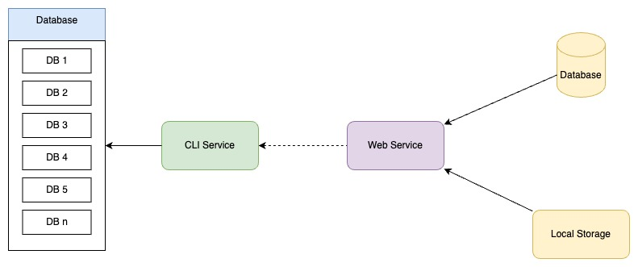
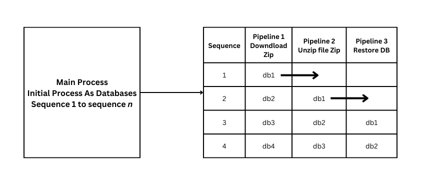

## Topik #5 : *CLI App & Web Service : Database Auto Restore*

### Deskripsi Project 

Anda adalah seorang system engineer yang bekerja pada sebuah perusahaan multinasional yang bergerak dalam pengembangan sistem enterprise. Saat ini perusahaan anda telah meng-handle lebih dari 100 client mulai dari sistem hingga infrastruktur yang mereka gunakan. 

Suatu hari technical lead di perusahaan anda, meminta teman untuk membuat service app untuk melakukan automation backup database pada setiap project client setiap harinya. Yang dimana setiap database yang telah di *dump* lalu di compress dengan ZIP lalu di upload ke sebuah web service yang fungsi utamanya untuk menerima backup database yang sudah di zip/compress.

Kemudian anda diminta untuk membuat tool yang dapat melakukan restore dari file zip database yang sudah diupload, dengan cara mendownload dari Web Service yang telah dibuat lalu, melakukan `unzip`,  kemudian melakukan import db ke database kosongan.

### Project Specification



Pada project ini akan ada 2 aplikasi/service yang ada harus buat

#### 1. Web Service

Sesuai dengan informasi yang diberikan oleh tech lead anda, bahwa akan ada web service yang memiliki tugas untuk menerima dan memberikan file zip hasil backup database. Yang dimana untuk spesifikasi pada web service nantinya adalah sebagai berikut

1. Detail routing yang harus dimiliki oleh web service
   
   | Path | Method | Req Param | Body | Response | Deskripsi |
   |:-----|:-------|:----------|:-----|:---|:---|
   | /| GET |-|-| [Response 1](#response-1)|Memberikan list database yang dibackup terakhir| 
   | /{db_name}|GET | `db_name` : adalah nama database yang pernah di backup |-|[Response 2](#response-2)| Memberikan list history sebuah database file zip yang pernah di upload |
   | /{db_name}|POST |`db_name` : adalah nama database yang pernah di backup |`multipart/form-data` body dari file zip dan `db_name` sebagai parameter |[Response 3](#response-3)| Melakukan upload file zip ke web service|
   |/{id_file}/download| GET |`id_file`: merupakan id file yang ingin di download|file zip dari storage|stream data |Melakukan download file|

   ###### Response 1
```json
   {
    "data": [
            {
                "database_name": "pt_xyz",
                "latest_backup": {
                    "id": 34,
                    "file_name": "mysql-2023-10-31-00-00-00-pt_xyz-0f69a75b-9fdf-48c6-8ec9-2277934b7bb8.sql.zip",
                    "timestamp": "2023-10-31 00:00:00"
                }
            },
            {
                "database_name": "pt_abc",
                "latest_backup": {
                    "id": 100,
                    "file_name": "mysql-2023-10-31-00-00-00-pt_abc-c584d377-0082-4473-a32b-29510d922fde.zip",
                    "timestamp": "2023-10-31 00:00:00"
                }
            },
            {
                "database_name": "pt_limajari",
                "latest_backup": {
                    "id": 201,
                    "file_name": "mysql-2023-10-31-00-00-00-pt_limajari-6077b272-9f9f-4fe2-9924-b92b2cbbc2d5.sql.zip",
                    "timestamp": "2023-10-31 00:00:00"
                }
            },
            {
                "database_name": "cv_kucing_oren",
                "latest_backup": {
                    "id": 303,
                    "file_name": "mysql-2023-10-31-00-00-00-cv_kucing_oren-0f69a75b-9fdf-48c6-8ec9-2277934b7bb8.sql.zip",
                    "timestamp": "2023-10-31 00:00:00"
                }
            },
    ],
    "message": "Success"
   }
```

   ###### Response 2
```json
    {
        "data": {
            "database_name": "cv_kucing_oren",
            "histories": [
                {
                    "id" : 303,
                    "file_name": "mysql-2023-10-31-00-00-00-cv_kucing_oren-0f69a75b-9fdf-48c6-8ec9-2277934b7bb8.sql.zip",
                    "timestamp": "2023-10-31 00:00:00"
                },
                {
                    "id": 299,
                    "file_name": "mysql-2023-10-30-00-00-00-cv_kucing_oren-7634bf3f-23b5-45a7-8b78-fe9b1a3bcf66.sql.zip",
                    "timestamp": "2023-10-30 00:00:00"
                },
                {
                    "id": 295,
                    "file_name": "mysql-2023-10-29-00-00-00-cv_kucing_oren-8634bf3f-23b5-45a7-8b78-fe9b1a3bcf66.sql.zip",
                    "timestamp": "2023-10-29 00:00:00"
                }
            ]
        },
        "message": "success"
    }
```

   ##### Response 3
```json
    {
        "data": {
            "id": 295,
            "database_name": "cv_kucing_oren",
            "file_name": "mysql-2023-10-29-00-00-00-cv_kucing_oren-8634bf3f-23b5-45a7-8b78-fe9b1a3bcf66.sql.zip",
            "timestamp": "2023-10-29 00:00:00"
        },
        "message": "success"
    }
```

2. Web Service menggunakan database MySQL yang digunakan untuk menyimpan history file yang pernah disimpan, struktur database dapat disesuikan seperti response data diatas.
3. Web Service juga akan menyimpan file yang di upload nantinya kedalam sebuah folder, yang dimana ketika file ingin didownload, web service dapat penyediakan fungsi untuk mendownload tersebut.
4. Penamaan file yang disimpan adalah file dari client, web service tidak melakukan renaming.
5. Web Service memastikan data yang dikirim sesuai dengan validation.
6. Untuk memastikan bahwa yang akan menggunakan web service ini harus di-authenticate maka web service harus dibuatkan middleware yang memvalidasi `Authorization` header yang dikirimkan oleh client untuk semua route, dimana mekanisme authentication dapat menggunakan static token yang disimpan di server dan client
7. Setiap case error harus di handle oleh Web Service.
8. Dilengkapi dengan unit testing.

#### 3. CLI App

1. Pada aplikasi CLI ini dimulai dari membaca file konfigurasi database yang digunakan, yang dimana list database yang ingin direstore dilisting pada file ini dan tidak dilakukan hardcode yang selanjutnya disebut dengan file `config.json`. [Contoh file config.json](#sample-1)
2. Setelah melakukan load terhadap file `config.json`, maka akan di fetch secara konkuren dari semua database yang terlisting pada file json dengan data pada web service, dimana akan mengambil history file yang paling terakhir untuk di download. 
3. Lalu download file backup pada database yang dipilih. [Contoh code](#sample-4)
4. Jika sudah melakukan download file `zip` pada web service, selanjutnya file `.zip` tersebut disimpan pada local folder lalu di `unzip`. Sehingga akan mendapatkan file `.sql` yang siap untuk di-import ke dalam database. Unzip dapat menggunakan package `archive/zip`. [Contoh code unzip](#sample-2)
5. Setelah melakukan `unzip` langkah selanjutnya adalah membuat database, lalu meng-import `.sql` file kedatabase yang telah dibuat. [Contoh code](#sample-3)
6. Pastikan proses diatas berjalan menggunakan `concurency` dan disarankan menggunakan `pipeline pattern` sehingga lebih mudah dalam mamanaje `channel`. [Contoh konsep](#sample-5)

##### Sample 1
```json
[
    {
        "database_name": "pt_xyz",
        "db_host": "192.168.0.1",
        "db_port": "3306",
        "db_username": "user",
        "db_password": "password"
    },
    {
        "database_name": "pt_abc",
        "db_host": "192.168.0.2",
        "db_port": "3306",
        "db_username": "user",
        "db_password": "password"
    }
]
```

##### Sample 2
```go
package main

import (
    "archive/zip"
    "fmt"
    "io"
    "os"
    "path/filepath"
)

// unzipExtraktor akan mengekstrak file ZIP ke direktori tujuan.
func unzipExtractor(zipFile, destDir string) error {
    // Buka file ZIP untuk dibaca.
    r, err := zip.OpenReader(zipFile)
    if err != nil {
        return err
    }
    defer r.Close()

    // Buat direktori tujuan jika belum ada.
    os.MkdirAll(destDir, 0755)

    // Iterasi melalui setiap file/entri dalam file ZIP.
    for _, f := range r.File {
        // Tentukan path file tujuan.
        filePath := filepath.Join(destDir, f.Name)

        // Buat direktori untuk file jika diperlukan.
        if f.FileInfo().IsDir() {
            os.MkdirAll(filePath, f.Mode())
            continue
        }

        // Buka file dalam arsip ZIP.
        rc, err := f.Open()
        if err != nil {
            return err
        }
        defer rc.Close()

        // Buat file tujuan.
        fDest, err := os.OpenFile(filePath, os.O_WRONLY|os.O_CREATE|os.O_TRUNC, f.Mode())
        if err != nil {
            return err
        }
        defer fDest.Close()

        // Salin isi file dari ZIP ke file tujuan.
        _, err = io.Copy(fDest, rc)
        if err != nil {
            return err
        }
    }

    return nil
}

func main() {
    zipFile := "path/to/your/file.zip" // Ganti dengan path file ZIP Anda
    destDir := "path/to/extract/destination" // Ganti dengan direktori tujuan ekstraksi

    if err := unzipExtractor(zipFile, destDir); err != nil {
        fmt.Println("Error unzipping file:", err)
    } else {
        fmt.Println("Unzipping completed successfully")
    }
}
```

##### Sample 3
```go
package main

import (
    "fmt"
    "os/exec"
)

func main() {
    // Tentukan kredensial dan detail database
    // Ambil dari file config.json

    dbHost := "host"
    dbPort := "port"
    dbName := "nama_database"
    dbUser := "user_database"
    dbPassword := "password_database"
    filePath := "path/ke/your/database.sql" // Path ke file SQL dari hasil unzip

    // Buat string perintah untuk impor database
    // Gunakan `mysql` command untuk impor database
    // Pastikan pada laptop/device sudah ter-install mysql
    cmdString := fmt.Sprintf("mysql -u %s -p%s %s < %s", dbUser, dbPassword, dbName, filePath)

    // Jalankan perintah menggunakan shell (bash) untuk memastikan pengalihan input (<) bekerja
    cmd := exec.Command("bash", "-c", cmdString)

    // Jalankan perintah dan tangani error
    err := cmd.Run()
    if err != nil {
        fmt.Printf("Error executing command: %s\n", err)
        return
    }

    fmt.Println("Database imported successfully")
}

```

##### Sample 4
```go
package main

import (
    "io"
    "net/http"
    "os"
    "fmt"
)

// downloadFile fungsi untuk mendownload file dari URL tertentu dan menyimpannya ke path lokal.
func downloadFile(fileURL, savePath string) error {
    // Buat HTTP request
    resp, err := http.Get(fileURL)
    if err != nil {
        return err
    }
    defer resp.Body.Close()

    // Pastikan kita mendapatkan respons HTTP 200 OK.
    if resp.StatusCode != http.StatusOK {
        return fmt.Errorf("server return non-200 status: %d %s", resp.StatusCode, resp.Status)
    }

    // Buat file lokal
    outFile, err := os.Create(savePath)
    if err != nil {
        return err
    }
    defer outFile.Close()

    // Salin data dari HTTP response ke file lokal
    _, err = io.Copy(outFile, resp.Body)
    return err // akan nil jika tidak ada error
}

func main() {
    // URL layanan web, ganti {id} dengan ID yang sesuai.
    fileURL := "http://web-service/{id}/download"

    // Path lokal tempat file akan disimpan
    savePath := "/path/to/your/local/filename.zip"

    // Panggil fungsi download
    if err := downloadFile(fileURL, savePath); err != nil {
        fmt.Printf("Error downloading file: %s\n", err)
    } else {
        fmt.Println("File downloaded successfully.")
    }
}

```

##### Sample 5


